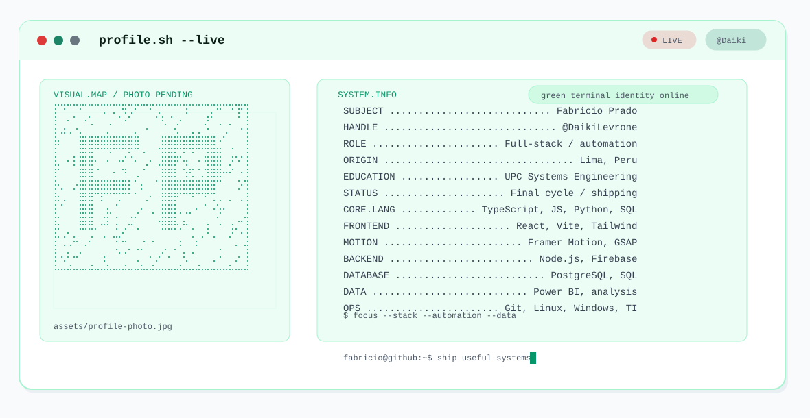
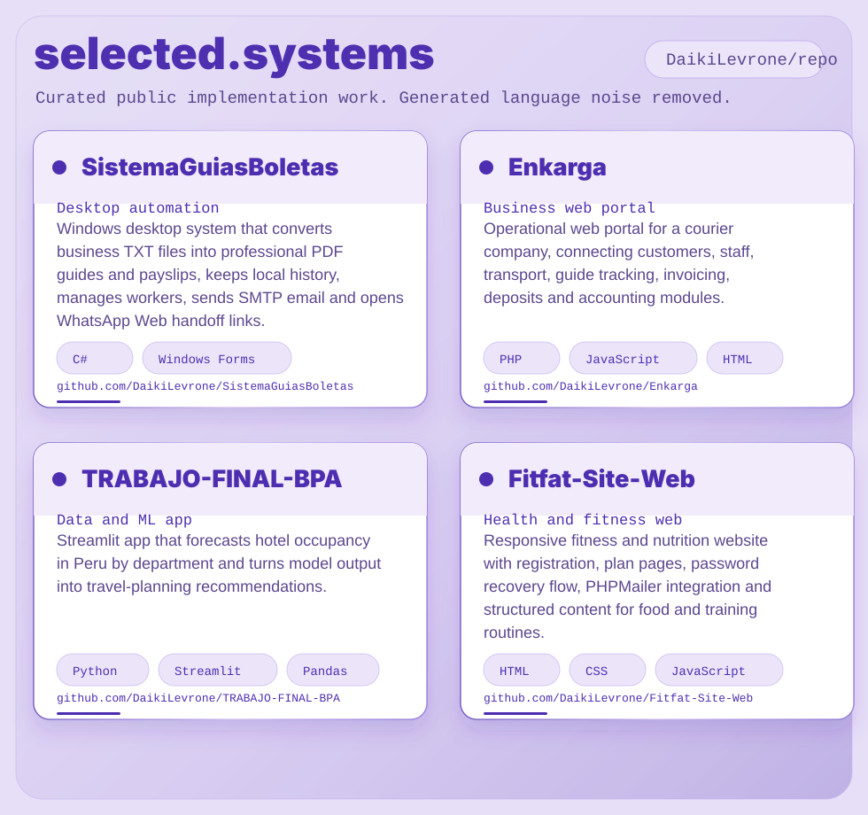

<picture>
  <source media="(prefers-color-scheme: dark)" srcset="dark.svg">
  <source media="(prefers-color-scheme: light)" srcset="light.svg">
  
</picture>

# Fabricio Prado

I am a final-cycle Systems Engineering student at UPC in Lima, Peru. My work sits between full-stack development, process automation, IT support and data/systems analysis: useful software, clear flows and maintainable delivery.

I build with React, Vite, TypeScript, JavaScript, Tailwind, Framer Motion, GSAP, Python, SQL, Power BI, PostgreSQL, Firebase, Node.js, Git/GitHub, Linux and Windows.

## Operating Range

| Area | What I do |
| --- | --- |
| Full-stack | Front-end interfaces, backend services, CRUD flows and practical integrations. |
| Automation | Desktop utilities, document generation, release scripts and workflow cleanup. |
| Data | SQL analysis, Power BI reporting, Python models and decision-support dashboards. |
| Support TI | Windows/Linux troubleshooting, operational continuity and user-focused fixes. |

## Stack

  
  
  
  
  
  
  
  
  
  

## Selected Work

<picture>
  <source media="(prefers-color-scheme: dark)" srcset="assets/projects-dark.svg">
  <source media="(prefers-color-scheme: light)" srcset="assets/projects-light.svg">
  
</picture>

<!-- PROJECTS:START -->
### [SistemaGuiasBoletas](https://github.com/DaikiLevrone/SistemaGuiasBoletas)
**Desktop automation** - Windows desktop system that converts business TXT files into professional PDF guides and payslips, keeps local history, manages workers, sends SMTP email and opens WhatsApp Web handoff links.

- Impact: Turns a manual document workflow into a structured local app with PDF generation, SQLite persistence, installer packaging and release-update support.
- Stack: C#, Windows Forms, .NET Framework 4.8, SQLite, Crystal Reports, SMTP, Inno Setup
- Links: [Repository](https://github.com/DaikiLevrone/SistemaGuiasBoletas) - Demo: not public

### [Enkarga](https://github.com/DaikiLevrone/Enkarga)
**Business web portal** - Operational web portal for a courier company, connecting customers, staff, transport, guide tracking, invoicing, deposits and accounting modules.

- Impact: Shows end-to-end CRUD modules across operations and finance, with backend controllers, database scripts and a full web interface.
- Stack: PHP, JavaScript, HTML, CSS, SQL, Bootstrap, Dompdf
- Links: [Repository](https://github.com/DaikiLevrone/Enkarga) - Demo: not public

### [TRABAJO-FINAL-BPA](https://github.com/DaikiLevrone/TRABAJO-FINAL-BPA)
**Data and ML app** - Streamlit app that forecasts hotel occupancy in Peru by department and turns model output into travel-planning recommendations.

- Impact: Combines data preparation, a trained Random Forest model, user-facing filters, metrics and tourism context into an analytical decision tool.
- Stack: Python, Streamlit, Pandas, NumPy, Scikit-learn model, Pickle
- Links: [Repository](https://github.com/DaikiLevrone/TRABAJO-FINAL-BPA) - Demo: not public

### [Fitfat-Site-Web](https://github.com/DaikiLevrone/Fitfat-Site-Web)
**Health and fitness web** - Responsive fitness and nutrition website with registration, plan pages, password recovery flow, PHPMailer integration and structured content for food and training routines.

- Impact: Demonstrates front-end delivery, PHP form handling, email flows and mobile-specific page variants for a content-rich consumer site.
- Stack: HTML, CSS, JavaScript, PHP, PHPMailer, Responsive UI
- Links: [Repository](https://github.com/DaikiLevrone/Fitfat-Site-Web) - Demo: not public
<!-- PROJECTS:END -->

## GitHub Signal

<picture>
  <source media="(prefers-color-scheme: dark)" srcset="https://streak-stats.demolab.com?user=DaikiLevrone&hide_border=true&background=06110D&stroke=1E3A2D&ring=10B981&fire=34D399&currStreakLabel=10B981&sideLabels=9CA3AF&currStreakNum=F8FAFC&sideNums=F8FAFC&dates=9CA3AF">
  <source media="(prefers-color-scheme: light)" srcset="https://streak-stats.demolab.com?user=DaikiLevrone&hide_border=true&background=F8FAFC&stroke=A7F3D0&ring=047857&fire=059669&currStreakLabel=047857&sideLabels=4B5563&currStreakNum=0B1F16&sideNums=0B1F16&dates=4B5563">
  
</picture>

  <picture>
    <source media="(prefers-color-scheme: dark)" srcset="https://github-profile-summary-cards.vercel.app/api/cards/stats?username=DaikiLevrone&theme=github_dark">
    <source media="(prefers-color-scheme: light)" srcset="https://github-profile-summary-cards.vercel.app/api/cards/stats?username=DaikiLevrone&theme=github">
    
  </picture>
  <picture>
    <source media="(prefers-color-scheme: dark)" srcset="https://github-profile-summary-cards.vercel.app/api/cards/repos-per-language?username=DaikiLevrone&theme=github_dark">
    <source media="(prefers-color-scheme: light)" srcset="https://github-profile-summary-cards.vercel.app/api/cards/repos-per-language?username=DaikiLevrone&theme=github">
    
  </picture>

<picture>
  <source media="(prefers-color-scheme: dark)" srcset="https://raw.githubusercontent.com/DaikiLevrone/DaikiLevrone/output/github-snake-dark.svg">
  <source media="(prefers-color-scheme: light)" srcset="https://raw.githubusercontent.com/DaikiLevrone/DaikiLevrone/output/github-snake.svg">
  
</picture>

## Profile Assets

- Banner source: `scripts/generate_banner.py`
- Project panel source: `scripts/generate_project_panel.py`
- Project metadata: `projects.json`
- Pending personal photo: `assets/profile-photo.jpg`

The current banner uses a neutral point map because no personal photo was present in this folder. Add the photo at `assets/profile-photo.jpg` and rerun the generator to create a real point portrait.
